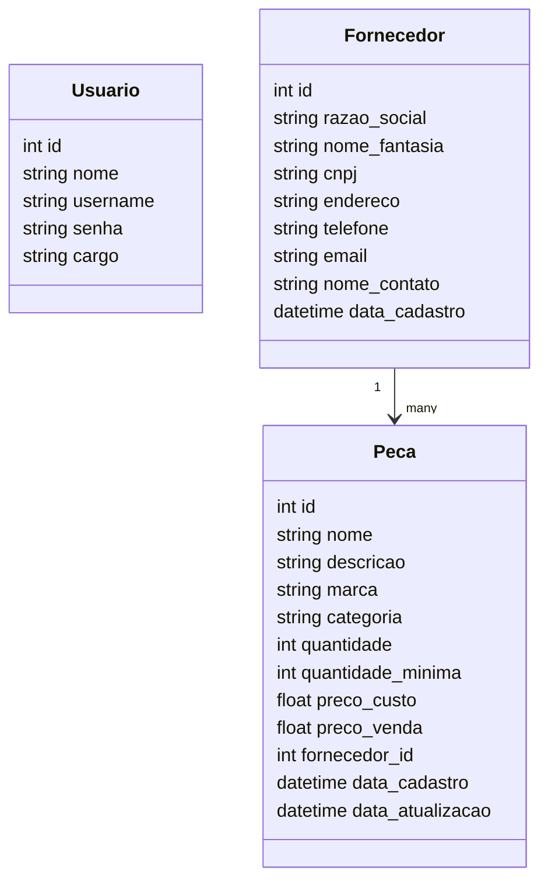

# Sistema de Gerenciamento de Estoque para Oficina Mecânica

## Sobre o Projeto

Este projeto foi desenvolvido como sistema de gerenciamento de estoque para uma oficina mecânica, com foco em simplicidade, organização e facilidade de uso.

O sistema permite:

* Controle de peças
* Controle de fornecedores
* Controle de usuários
* Controle de acesso por cargo
* Relatórios simples

O projeto foi desenvolvido utilizando:

* Node.js
* Express.js
* SQLite
* EJS
* Bootstrap

---

# Funcionalidades

## Autenticação

* Login com usuário e senha
* Sessão autenticada
* Logout
* Senhas armazenadas com hash utilizando bcrypt

---

## Controle de Usuários

Somente usuários com cargo de gerente podem:

* Criar usuários
* Editar usuários
* Excluir usuários

Tipos de usuários:

* gerente
* funcionário

---

## Controle de Fornecedores

Permite:

* Cadastrar fornecedor
* Editar fornecedor
* Excluir fornecedor
* Mostrar fornecedores

---

## Controle de Peças

Permite:

* Cadastrar peça
* Editar peça
* Excluir peça
* Relacionar peça com fornecedor
* Controle de quantidade
* Controle de estoque mínimo

---

# Banco de Dados

O sistema utiliza SQLite.

O banco é criado automaticamente ao iniciar o projeto.

Arquivo do banco:

```text
db/database.sqlite
```

---

## Modelo de Dados

O sistema segue o seguinte modelo relacional:



---

# Instalação do Projeto

## 1. Clonar repositório

```bash
git clone https://github.com/odamonique/estoque-oficina
```

---

## 2. Entrar na pasta do projeto

```bash
cd estoque-oficina
```

---

## 3. Instalar dependências

```bash
npm install
```

---

## 4. Configurar variáveis de ambiente

Copie o arquivo `.env.example`:

```bash
cp .env.example .env
```

Depois, edite o arquivo `.env` e defina um valor para:

```env
SESSION_SECRET=seu_segredo
```

---

## 5. Iniciar o sistema

```bash
npm start
```

---

## 6. Criar usuário gerente inicial

Executar:

```bash
node seed.js
```

Usuário padrão do sistema:

```text
Usuário: admin
Senha: 123
Cargo: gerente
```

---

# Estrutura do Projeto

```text
/project
├── controllers/    # Lógica de negócio
├── db/             # Configuração do banco SQLite
├── middlewares/    # Middlewares de autenticação
├── public/         # Arquivos estáticos
├── routes/         # Rotas do Express
├── views/          # Templates EJS
├── .env.example    # Exemplo de variáveis de ambiente
├── app.js          # Aplicação principal
├── seed.js         # Script para popular o banco
├── package.json
└── README.md
```

---

# Controle de Acesso

## Gerente

Pode:

* Gerenciar usuários
* Gerenciar fornecedores
* Gerenciar peças
* Acessar relatórios

---

## Funcionário

Pode:

* Gerenciar fornecedores
* Gerenciar peças

Não pode:

* Acessar relatórios
* Gerenciar usuários

---

# Relatórios

O sistema possui relatórios simples para:

* Listagem de peças
* Controle de estoque
* Identificação de estoque baixo

---

# Segurança

O sistema utiliza:

* Sessões autenticadas
* Middleware de proteção de rotas
* Controle de permissões
* Senhas criptografadas com bcrypt

---

# Observações

Este projeto foi desenvolvido com foco acadêmico, priorizando:

* Simplicidade
* Organização
* Facilidade de manutenção
* Facilidade de uso

---

# Autor

Monique Yabu Recaldi

